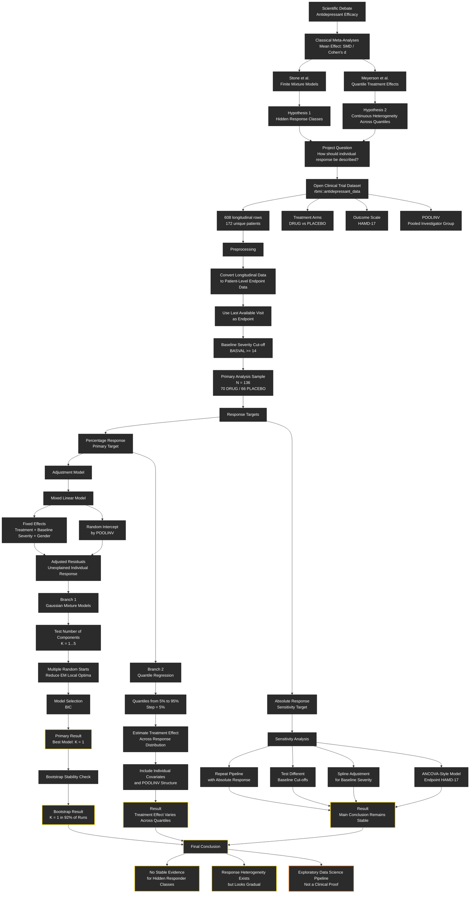

```mermaid
graph TD
    %% =====================
    %% Scientific Background
    %% =====================
    A0[Scientific Debate<br/>Antidepressant Efficacy]
    A1[Classical Meta-Analyses<br/>Mean Effect: SMD / Cohen's d]
    A2[Stone et al.<br/>Finite Mixture Models]
    A3[Meyerson et al.<br/>Quantile Treatment Effects]

    A0 --> A1
    A1 --> A2
    A1 --> A3

    %% =====================
    %% Research Question
    %% =====================
    B0[Project Question<br/>How should individual response be described?]
    B1[Hypothesis 1<br/>Hidden Response Classes]
    B2[Hypothesis 2<br/>Continuous Heterogeneity Across Quantiles]

    A2 --> B1
    A3 --> B2
    B1 --> B0
    B2 --> B0

    %% =====================
    %% Data
    %% =====================
    C0[Open Clinical Trial Dataset<br/>rbmi::antidepressant_data]
    C1[608 longitudinal rows<br/>172 unique patients]
    C2[Treatment Arms<br/>DRUG vs PLACEBO]
    C3[Outcome Scale<br/>HAMD-17]
    C4[POOLINV<br/>Pooled Investigator Group]

    B0 --> C0
    C0 --> C1
    C0 --> C2
    C0 --> C3
    C0 --> C4

    %% =====================
    %% Preprocessing
    %% =====================
    D0[Preprocessing]
    D1[Convert Longitudinal Data<br/>to Patient-Level Endpoint Data]
    D2[Use Last Available Visit<br/>as Endpoint]
    D3[Baseline Severity Cut-off<br/>BASVAL >= 14]
    D4[Primary Analysis Sample<br/>N = 136<br/>70 DRUG / 66 PLACEBO]

    C1 --> D0
    D0 --> D1
    D1 --> D2
    D2 --> D3
    D3 --> D4

    %% =====================
    %% Response Targets
    %% =====================
    E0[Response Targets]
    E1[Percentage Response<br/>Primary Target]
    E2[Absolute Response<br/>Sensitivity Target]

    D4 --> E0
    E0 --> E1
    E0 --> E2

    %% =====================
    %% Adjustment Model
    %% =====================
    F0[Adjustment Model]
    F1[Mixed Linear Model]
    F2[Fixed Effects<br/>Treatment + Baseline Severity + Gender]
    F3[Random Intercept<br/>by POOLINV]
    F4[Adjusted Residuals<br/>Unexplained Individual Response]

    E1 --> F0
    F0 --> F1
    F1 --> F2
    F1 --> F3
    F2 --> F4
    F3 --> F4

    %% =====================
    %% FMM Branch
    %% =====================
    G0[Branch 1<br/>Gaussian Mixture Models]
    G1[Test Number of Components<br/>K = 1...5]
    G2[Multiple Random Starts<br/>Reduce EM Local Optima]
    G3[Model Selection<br/>BIC]
    G4[Bootstrap Stability Check]
    G5[Primary Result<br/>Best Model: K = 1]
    G6[Bootstrap Result<br/>K = 1 in 92% of Runs]

    F4 --> G0
    G0 --> G1
    G1 --> G2
    G2 --> G3
    G3 --> G5
    G5 --> G4
    G4 --> G6

    %% =====================
    %% Quantile Regression Branch
    %% =====================
    H0[Branch 2<br/>Quantile Regression]
    H1[Quantiles from 5% to 95%<br/>Step = 5%]
    H2[Estimate Treatment Effect<br/>Across Response Distribution]
    H3[Include Individual Covariates<br/>and POOLINV Structure]
    H4[Result<br/>Treatment Effect Varies Across Quantiles]

    E1 --> H0
    H0 --> H1
    H1 --> H2
    H2 --> H3
    H3 --> H4

    %% =====================
    %% Sensitivity Analysis
    %% =====================
    I0[Sensitivity Analysis]
    I1[Repeat Pipeline<br/>with Absolute Response]
    I2[Test Different<br/>Baseline Cut-offs]
    I3[Spline Adjustment<br/>for Baseline Severity]
    I4[ANCOVA-Style Model<br/>Endpoint HAMD-17]
    I5[Result<br/>Main Conclusion Remains Stable]

    E2 --> I0
    I0 --> I1
    I0 --> I2
    I0 --> I3
    I0 --> I4
    I1 --> I5
    I2 --> I5
    I3 --> I5
    I4 --> I5

    %% =====================
    %% Final Conclusion
    %% =====================
    J0[Final Conclusion]
    J1[No Stable Evidence<br/>for Hidden Responder Classes]
    J2[Response Heterogeneity Exists<br/>but Looks Gradual]
    J3[Exploratory Data Science Pipeline<br/>Not a Clinical Proof]

    G6 --> J0
    H4 --> J0
    I5 --> J0
    J0 --> J1
    J0 --> J2
    J0 --> J3

    %% =====================
    %% Styling
    %% =====================
    classDef dark fill:#2B2B2B,color:#FFFFFF,stroke:#111111,stroke-width:1px
    classDef result fill:#2B2B2B,color:#FFFFFF,stroke:#FFD600,stroke-width:2px
    classDef warning fill:#2B2B2B,color:#FFFFFF,stroke:#FF6D00,stroke-width:2px

    class A0,A1,A2,A3,B0,B1,B2 dark
    class C0,C1,C2,C3,C4 dark
    class D0,D1,D2,D3,D4 dark
    class E0,E1,E2 dark
    class F0,F1,F2,F3,F4 dark
    class G0,G1,G2,G3,G4 dark
    class H0,H1,H2,H3 dark
    class I0,I1,I2,I3,I4 dark
    class G5,G6,H4,I5,J0,J1,J2 result
    class J3 warning
```
