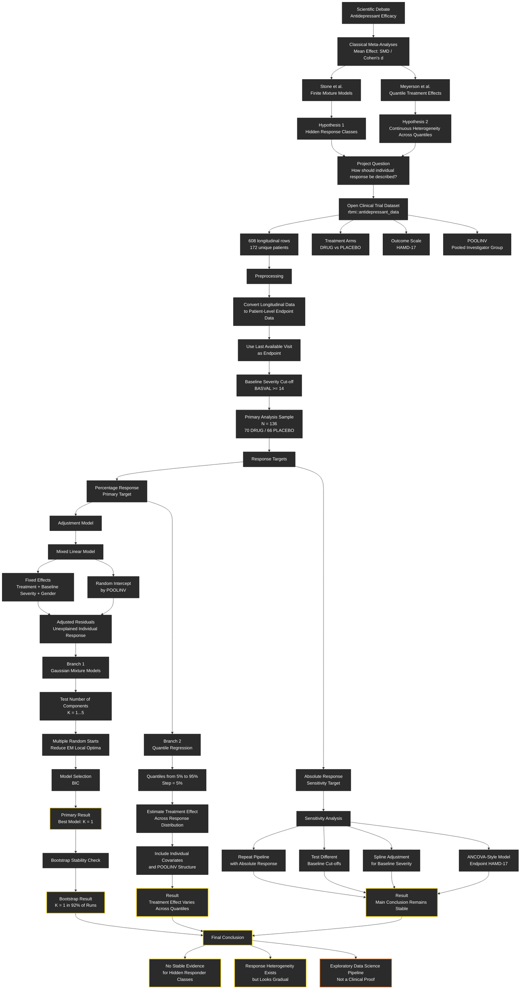

# Stone & Mayerson Re-analysis

An exploratory data-science re-analysis of an open antidepressant clinical-trial
dataset that tests a live scientific debate: **is the heterogeneity of
antidepressant treatment response better described by discrete latent responder
subgroups (Stone et al.) or by a continuous change of the treatment effect across
the response distribution (Meyerson et al.)?**

> ⚠️ **Scope note.** This is an exploratory pipeline on a *single* open dataset
> (`rbmi::antidepressant_data`). It is **not** an IPD meta-analysis and **not** a
> clinical proof of biological response phenotypes. See
> [Limitations](#limitations).

---

## Scientific background

Classical antidepressant meta-analyses report an average effect size (Cohen's *d*
/ standardized mean difference). The same average can hide very different
underlying pictures — "helps everyone a little" vs. "helps a few a lot" — so two
recent re-analyses of FDA-submitted individual patient data reached different
conclusions about what the response distribution looks like:

| Paper | Method | Interpretation |
| --- | --- | --- |
| [**Stone et al., BMJ 2022**](https://www.bmj.com/content/378/bmj-2021-067606) | Finite Mixture Models (FMM) on 232 placebo-controlled trials | The response distribution is **trimodal** — Large / Non-specific / Minimal response. Active treatment shifts patients into the large-response class. |
| [**Meyerson et al., JAMA Network Open 2023**](https://jamanetwork.com/journals/jamanetworkopen/fullarticle/2805805) | Quantile Treatment Effects (QTE), baseline HAMD ≥ 20 | The treatment distribution beats placebo at **every** quantile (max separation ≈ 55th quantile) → **continuous** heterogeneity, not rigid classes. |
| [**Xu et al., J. Clin. Epidemiol. 2025**](https://www.jclinepi.com/article/S0895-4356(25)00276-8/fulltext) | Replication of the trimodal FMM on STAR*D | Could **not** reproduce the three Stone et al. components. |

This project takes that debate as its motivation and runs both interpretations on
one open dataset to see which one is more stable.

---

## Research question

> Does heterogeneity of antidepressant response in an open clinical dataset look
> more like **stable latent subgroups with a trimodal response**, or like a
> **continuous change of the treatment effect across the response distribution**?

---

## Pipeline



---

## Data

The open longitudinal dataset [`antidepressant_data`](https://openpharma.github.io/rbmi/main/reference/antidepressant_data.html)
from the R package `rbmi` is used.

| Column | Meaning |
| --- | --- |
| `PATIENT` | patient identifier |
| `THERAPY` | `DRUG` / `PLACEBO` |
| `BASVAL` | baseline HAMD-17 |
| `HAMDTL17` | HAMD-17 at the visit |
| `CHANGE` | change in HAMD-17 (`HAMDTL17 - BASVAL`) |
| `VISIT` | visit number |
| `POOLINV` | pooled-investigator / site-level grouping variable |
| `GENDER` | patient gender |

After reshaping to one row per patient (last available visit) and applying the
baseline severity cut-off `BASVAL ≥ 14`, the **primary analysis sample** is
**N = 136** (70 DRUG / 66 PLACEBO).

---

## Methodology

### Preprocessing
Long format → one row per patient using the **last available visit** (reduces
dropout loss). Baseline severity cut-off `BASVAL ≥ 14` (the HDRS ≥ 14 gold
standard noted by Xu et al.) stabilizes the percentage-response target.

### Response targets
- **Primary:** `percentage_response = (baseline - endpoint) / baseline`
- **Sensitivity:** `absolute_response = baseline - endpoint = -CHANGE`

### Adjustment model
A linear mixed model with a `POOLINV` random intercept, fixed effects for
treatment, baseline severity (centered within `POOLINV`, following Stone et al.
/ Burke et al. to avoid the ecological fallacy), and gender. Falls back to OLS
with `C(POOLINV)` fixed effects and HC3 robust errors if `MixedLM` fails to
converge (small site sizes). The **adjusted residuals** — the part of individual
response not explained by treatment, baseline severity, gender, and site — are
fed into the FMM.

### Branch 1 — Finite Mixture Models (FMM)
Gaussian Mixture Models fit by EM with **100 random starts** per candidate,
tested for **K = 1…5** components and all four covariance types, selected by
**BIC**. Stability is checked by **150-iteration bootstrap** (the chosen K is
recorded on each resample).

### Branch 2 — Quantile regression
A practical adaptation of the QTE approach: quantile regression at **5%–95%**
(step 5%) with individual covariates

```
response ~ treatment + BASVAL_centered + gender_female
```

Goodness of fit is assessed with **pinball loss**, **pseudo R²**, and the
stability of the treatment coefficient when covariates are added.

### Sensitivity analysis
1. Target change: `percentage_response` → `absolute_response`
2. Endpoint change: `last_available` → `VISIT == 7`
3. Baseline threshold: no cut-off, 14, 18, 20, 24
4. Spline baseline adjustment (`bs(BASVAL_centered, df=3)`)
5. ANCOVA-style endpoint model on `HAMDTL17`

---

## Key results

| Metric | Value |
| --- | --- |
| Raw rows / unique patients | 608 / 172 |
| Primary sample (BASVAL ≥ 14, last visit) | **136** (70 DRUG / 66 PLACEBO) |
| Adjustment model | MixedLM (random intercept by `POOLINV`) |
| Treatment coef, percentage response (adjusted) | ≈ 0.137 |
| **Best FMM K, percentage response (BIC)** | **1** (single component) |
| Bootstrap stability, percentage response | **K = 1 in 92%** of replicates |
| Best FMM K, absolute response (BIC) | 2 (unstable — 47% of replicates) |
| QR treatment coef at the median (percentage response) | ≈ 0.215 |
| QR treatment coef at the median (absolute response) | ≈ 4.32 HAMD-17 pts |
| ANCOVA endpoint HAMD-17 benefit (linear) | ≈ **3.20 pts** |
| ANCOVA endpoint HAMD-17 benefit (spline) | ≈ 3.26 pts |

### Bottom line

- **No stable hidden responder classes.** For the primary percentage-response
  target the best GMM has a single component, confirmed by bootstrap (K = 1 in
  92% of replicates). The absolute-response hint of two components is unstable
  and depends on the endpoint/threshold choice.
- **Heterogeneity is real but gradual.** Quantile regression shows the
  DRUG–PLACEBO gap varies across the response distribution — patients improve
  by different amounts, without splitting into clear discrete types.
- **Robust to sensitivity checks.** The conclusion holds across target,
  endpoint, baseline cut-off, spline baseline adjustment, and the ANCOVA-style
  endpoint model.

> Individual heterogeneity of response exists, but in these data it is better
> described as a **varying degree of improvement** than as **several clear
> patient types**.

---

## Limitations

- A **single** open dataset is used — this is **not** an IPD meta-analysis and
  cannot adjudicate the Stone vs. Meyerson debate on its own.
- **Small N** (136 after filtering) and a **limited covariate set**; the FMM is
  applied to one-dimensional residuals, not the full feature space.
- The `DRUG` arm is **aggregated** (specific compounds are not distinguished).
- `POOLINV` groups are too small to interpret as independent trials; they are
  used only for regression adjustment.
- FMM components are a statistical construct — **not** claimed to be biological
  phenotypes.

Treat the results as **exploratory EDA**, not clinical evidence.

---

## How to run

The notebook targets **Google Colab** (or any Jupyter environment). No GPU/TPU
needed — the libraries are CPU-based.

1. Open `final_project_ds20.ipynb` in
   [Colab](https://colab.research.google.com/) or Jupyter.
2. Run the cells top to bottom. The first cell installs the dependencies:
   ```bash
   pip install -q pyreadr requests pandas numpy scipy scikit-learn statsmodels matplotlib seaborn
   ```
3. The data cell auto-downloads `antidepressant_data` from
   `cran/rbmi` on first run and caches it as `antidepressant_data.csv`.
4. Outputs (figures and result tables) are written to:
   ```
   reports/figures/    *.png plots
   reports/results/    *.csv tables (GMM selection, bootstrap, QR, ANCOVA, main_summary)
   ```

> The notebook is delivered **without cached outputs** so it is small and easy
> to diff; re-run it to regenerate figures and tables.

---

## Project layout

```
final_project_ds20.ipynb   full analysis pipeline (English)
README.md                  this file
reports/                   generated on a run
  figures/                 EDA, FMM, QR, sensitivity plots
  results/                 CSV tables + main_summary.csv
```

---

## References

1. Stone et al. "Efficacy of antidepressants in adults" — *BMJ* 2022.
   https://www.bmj.com/content/378/bmj-2021-067606
2. Meyerson et al. — *JAMA Network Open* 2023.
   https://jamanetwork.com/journals/jamanetworkopen/fullarticle/2805805
3. Xu et al. — *Journal of Clinical Epidemiology* 2025.
   https://www.jclinepi.com/article/S0895-4356(25)00276-8/fulltext
4. Burke et al. — *Statistics in Medicine* 2017.
   https://doi.org/10.1002/sim.7141
5. `rbmi::antidepressant_data` —
   https://openpharma.github.io/rbmi/main/reference/antidepressant_data.html